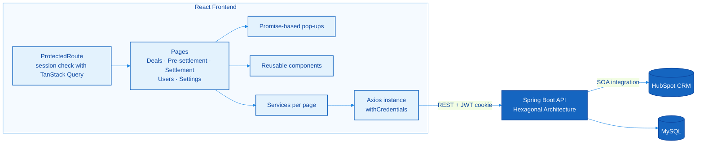

<!-- ===== HEADER ===== -->
<h1 align="center">🏠 Habitar Inmobiliaria — Commission Management Web App</h1>

<p align="center">
  React interface to import real estate deals from <b>HubSpot CRM</b>, pre-settle and settle agent commissions, and manage the agency's users and business rules.
</p>

<!-- ===== BADGES ===== -->
<p align="center">
  
  
  
  
  
  
</p>

<p align="center">
  <a href="https://github.com/COF9999/backend-inmobiliaria">Backend repository</a> ·
  <a href="#-demo-videos">Demo Videos</a> ·
  <a href="#-getting-started">Getting Started</a>
</p>

<!-- ===== HIGHLIGHTS ===== -->
> ⚡ **What makes this project stand out**
>
> - **Promise-based pop-ups:** modals that return a `Promise`, so complex user flows are written as simple, linear `async/await` code.
> - **SOA integration with the CRM:** the interface connects HubSpot and the backend services, turning CRM deals into settled commissions.
> - **Reusable components:** a configurable table, overlays, cards, filters and buttons shared across every view.

---

## 📑 Table of Contents

- [Overview](#-overview)
- [Demo Videos](#-demo-videos)
- [Features](#-features)
- [Architecture](#-architecture)
- [Promise-Based Pop-ups](#-promise-based-pop-ups)
- [Reusable Components](#-reusable-components)
- [Performance](#-performance)
- [Routes](#-routes)
- [Tech Stack](#-tech-stack)
- [Project Structure](#-project-structure)
- [Getting Started](#-getting-started)
- [Lessons Learned](#-lessons-learned)
- [Author](#-author)

---

## 📌 Overview

This is the web interface of a **custom commission management system built for Habitar Inmobiliaria**. It lets the agency review the deals closed in HubSpot, pre-settle them to check the numbers, settle them and track every payment, all from one place.

The different business lines (Sales and Rent) are abstracted into a single interface, and every page is fully customizable, so the system can be adapted to other types of companies.

The application was built in **less than 3 months**, in parallel with the [backend](https://github.com/COF9999/backend-inmobiliaria), a Java and Spring Boot API with Hexagonal Architecture.

---

## 🎬 Demo Videos

| | Video | What it shows |
|:---:|---|---|
| 1️⃣ | <a href="https://drive.google.com/file/d/1GMIbRAGABqFoEBf7lSlUgmKGSOJFTO8V/view"></a> | The system connected to a **live HubSpot account** (recorded on April 24, 2026) |
| 2️⃣ | <a href="https://drive.google.com/file/d/1QV8q7F24w39qOXuiwhsARA_ur_0vqDuI/view"></a> | The **settlement system**, which supports multiple business rules |
| 3️⃣ | <a href="https://drive.google.com/file/d/1dZJzWQvZaJNKcroYShkTup0Ea0hMudDo/view"></a> | Other **management pages**, fully customizable for different types of companies |

---

## ✨ Features

- **Authentication:** login and registration, with the session kept in an `HttpOnly` JWT cookie and private routes protected by `ProtectedRoute`.
- **Control panel:** home dashboard with an overview of the system.
- **Deals by business line:** separate views for the **Sales** and **Rent** funnels, each with a detail page per deal.
- **Pre-settlement:** calculates commissions before confirming them, so figures can be reviewed first.
- **Settlement:** settles deals coming from HubSpot and generates the settlement records.
- **User management:** user list, role changes and user creation.
- **Global variables:** business variables editable from the interface, without touching the code.

---

## 🏛️ Architecture

The interface communicates with the backend services, which in turn integrate with HubSpot. Every request goes through a shared Axios instance with `withCredentials: true`, so the JWT cookie is sent automatically.



Each page follows the same organization:

| Part | Responsibility |
|---|---|
| `Root*.jsx` | Layout of the section, rendering its child routes with `<Outlet />` |
| Page component | UI and user interaction |
| `services/` | API calls for that page, kept apart from the UI |
| `subModals/` | Content of the pop-ups specific to that page |

---

## 🪟 Promise-Based Pop-ups

In a typical React app, a confirmation modal forces the logic to be split across several state variables and callbacks. This project uses a [**Promise-based modal system**](https://medium.com/@dawoodmsam422/scalable-promise-based-modal-system-in-react-76178c53d5ba) instead: opening a modal returns a `Promise` that resolves with the user's answer.

The `useModal` hook stores the `resolve` function of each open modal, identified by an ID:

```jsx
const useModal = () => {
  const [modals, setModals] = useState({})

  const OpenPromise = useCallback((id, extraData = {}) => {
    return new Promise((resolve) => {
      setModals(prev => ({
        ...prev,
        [id]: { isOpen: true, resolve, ...extraData } // keeps resolve until the user answers
      }))
    })
  }, [])

  const ClosePromise = useCallback((id, value = null) => {
    const modal = modals[id]
    if (modal?.resolve === undefined) return
    modal.resolve(value) // unblocks the await
    setModals(prev => {
      const newState = { ...prev }
      delete newState[id]
      return newState
    })
  }, [modals])

  const getModal = useCallback((id) => modals[id] || { isOpen: false }, [modals])

  return { OpenPromise, ClosePromise, getModal }
}
```

With that, a complete flow (ask for the new role, call the API and show a confirmation) reads as one linear function:

```jsx
"event": async (item, self) => {
  const objectRoles = await OpenPromise(self.type, {
    typeFilter: self.type,
    listRoleCopy: extractRoles(item["roles"])
  })

  if (objectRoles === null) return // the user closed the pop-up

  const data = await changeRole(item, objectRoles, self.type)

  if (typeof data === "object") {
    await OpenPromise("MESSAGE", {
      fullInfo: { id: "MESSAGE", header: "Mensaje", body: "Cambio existoso de rol" }
    })
  }
}
```

### Actions as configuration

Each page describes its actions as a **list of configuration objects**. Every action has a type, an icon and an `async` event, so adding a new action to a table only means adding one more object to the list:

```jsx
const listActions = useMemo(() => [
  {
    "type": "ROLE-CHANGE",
    "svg": ChangeRoleIcon,
    "event": async (item, self) => {
      const objectRoles = await OpenPromise(self.type, { /* ... */ })
      if (objectRoles === null) return
      // call the API and show the result
    }
  },
  {
    "type": "CREATE-USER",
    "svg": AddUser,
    "event": async (item, self) => {
      const objectUser = await OpenPromise(self.type, { id: self.type })
      if (objectUser === null) return
      // create the user
    }
  },
], [OpenPromise])
```

The action's own `type` is also the ID of the pop-up it opens (`OpenPromise(self.type, ...)`), which connects each button to its modal without extra wiring.

### Several pop-ups on the same page

Because every modal is stored by ID, a page can declare several pop-ups and each one renders only when its ID is open. Related modals can even share a single component: `ROLE-CHANGE`, `ROLE-ADD` and `ROLE-DELETE` are resolved by one `PopUpActionsRole`, which adapts its content to the active type.

```jsx
const whichModalIsActive = ['ROLE-CHANGE', 'ROLE-ADD', 'ROLE-DELETE']
  .map(id => getModal(id))
  .find(m => m.isOpen)
const messageDialog = getModal("MESSAGE")
const createUserPopUp = getModal("CREATE-USER")
```

```jsx
{
  whichModalIsActive
  &&
  <PopUpActionsRole
    isActive={whichModalIsActive.isOpen}
    typeFilter={whichModalIsActive.typeFilter}
    roleList={whichModalIsActive.listRoleCopy}
    fullRoleList={FULL_ROLE_LIST}
    onComfirm={(role) => ClosePromise(whichModalIsActive.typeFilter, role)}
    onCancel={() => ClosePromise(whichModalIsActive.typeFilter, null)}
  />
}

<PopUpMessageDialog
  isActive={messageDialog.isOpen}
  fullInfo={messageDialog.fullInfo}
  onCancel={() => ClosePromise(messageDialog.fullInfo.id, null)}
/>

<PopUpCreateUser
  isActive={createUserPopUp.isOpen}
  onCancel={() => ClosePromise(createUserPopUp.id, null)}
/>
```

This is what allows chained flows: the role pop-up resolves, the API is called, and then the message pop-up opens, all inside the same `async` event.

### Closures for encapsulated state

The system relies on **closures** to keep its state private:

- The `modals` state lives inside the `useModal` hook. Pages cannot modify it directly; they can only use the three functions the hook exposes (`OpenPromise`, `ClosePromise` and `getModal`), which act as a controlled interface.
- Each `Promise` keeps its own `resolve` function stored until the user answers, so every modal knows exactly which flow to continue.
- In `TableObjects`, each button runs `() => action.event(item, action)`, a closure that captures the row it belongs to. The action always receives the correct record, without searching for it or storing it in extra state.

This encapsulation prevents other parts of the code from altering the modal state by mistake, which makes the flows more predictable and easier to maintain.

**Benefits**

- **Linear, readable flows:** each step waits for the previous one with `await`, instead of chaining callbacks and state flags.
- **Several modals at once:** every modal is stored by ID, so a page can declare many pop-ups and a flow can open a form and then a confirmation message.
- **Scalable:** adding a new modal only requires a new ID and its content, without new state variables.
- **Reusable:** the same hook serves any page that needs user input.
- **Encapsulated:** thanks to closures, the modal state can only change through the hook's functions.

---

## 🧩 Reusable Components

Shared components live in `components/pureComponents` and are configured through props, so every view reuses them instead of duplicating UI.

| Component | Purpose |
|---|---|
| `TableObjects` | Generic, memoized table. Receives the list, column translations, custom cell renderers and row actions; the *Actions* column and the empty state are added automatically |
| `Overlay` | Base container for every pop-up, with configurable header, content, vertical position, optional dimmed background and close button |
| `DialogModal` | Alert and confirmation dialog |
| `CardDetail` | Record card with its actions and a colored status border: green when a payment is completed, red when it is pending |
| `ProfessionalCard` | Three-column card built with Tailwind CSS: title and subtitle, a grid of data and a side panel of actions |
| `ButtonAction` | Button that receives an SVG icon and an action |
| `SearchInput` | Search field with an action icon |
| `MenuToggle` | Dropdown filter that returns the selected filter and value, or clears it |
| `WrapperUniqueFilter` | Groups two filter components side by side, such as a search field and a dropdown |
| `EditValues` | Inline editing of a value (label, input and action button), used for global variables |
| `RangeCalendar` | Date range picker for reports and filters |
| `SpinnerLoadingData` | Loading indicator |
| `UserMenu` | User menu with logout |

For example, `TableObjects` is configured entirely with constants and actions, so the same component renders the users table, the deals tables and others:

```jsx
<TableObjects
  list={listUser}
  translateColums={TRANSLATE_COLUMS}      // column names shown to the user
  coverPropertyColums={coverPropertyColumns} // how each cell is rendered
  subList={subList}                        // nested values, such as roles
  listActions={listActions}                // row actions that open Promise-based pop-ups
/>
```


### How `TableObjects` is built

The table does not know anything about users, deals or roles. It only knows how to render headers, rows and actions from what it receives, which is why the same component works for every view:

```jsx
export const TableObjects = memo(function TableObjects({
  translateColums, coverPropertyColums, list, subList, listActions, noValues
}) {
  return (
    <table className="table-result">
      <thead>
        <tr>
          {Object.values(translateColums).map(col => (
            <th key={`Translate-colum--${col}`}>{col}</th>
          ))}
          {listActions.length !== 0 ? <th>Acciones</th> : ""}
        </tr>
      </thead>
      <tbody>
        {!noValues && list.length > 0 ? (
          list.map((item, index) => (
            <tr key={`row-${item.id}-${index}`}>
              {coverPropertyColums ? coverPropertyColums(item) : null}
              {subList ? subList(item) : null}
              {listActions.length > 0 ? (
                <td key={`${item.id}-action-user`}>
                  {listActions.map((action, index) => (
                    <ButtonAction
                      SvgComponent={action.svg}
                      action={() => action.event(item, action)}
                    />
                  ))}
                </td>
              ) : null}
            </tr>
          ))
        ) : (
          <tr>
            <td colSpan="100%">No hay datos disponibles</td>
          </tr>
        )}
      </tbody>
    </table>
  )
})
```

| Prop | Role |
|---|---|
| `translateColums` | Object that maps each property to the header shown to the user |
| `coverPropertyColums` | Function that decides how each cell is rendered (for example, `true` → "Si") |
| `subList` | Function for nested values, such as the list of roles |
| `listActions` | Array of actions, each with an icon and an `async` event that can open Promise-based pop-ups |
| `noValues` | Forces the empty state |

This is the **render props** pattern: the parent page decides *what* to show and the table decides *how* to lay it out.

---

## ⚡ Performance

Views are optimized to avoid unnecessary re-renders, combining three React tools:

| Tool | Where it is used | Effect |
|---|---|---|
| `memo` | `TableObjects` | The table only re-renders when its props actually change |
| `useCallback` | Cell renderers, `OpenPromise`, `ClosePromise`, `getModal` | Functions keep the same reference between renders |
| `useMemo` | `listActions` | The actions array is created once, not on every render |

Constants such as `TRANSLATE_COLUMS` are also declared **outside** the component, so they are never recreated.

These tools work together. `memo` compares props by reference, so it would be useless if the page created new functions or arrays on every render. Because every prop passed to `TableObjects` is stable, opening or closing a pop-up updates the modal state of the page **without re-rendering the table**, which only renders again when the data list changes.

---

## 🗺️ Routes

The router is created with `createBrowserRouter` and the base path **`/app`**, so every route is served under it (for example, `/app/home`). Private routes are nested inside `ProtectedRoute`, and each section has its own layout (`Root*.jsx`) with child routes.

| Route | Page |
|---|---|
| `/app/` | Login |
| `/app/register` | Registration |
| `/app/home` | Control panel 🔒 |
| `/app/deals` | Deals by business line 🔒 |
| `/app/deals/funnel-sale` · `/app/deals/funnel-sale/detail/:id` | Sales funnel and deal detail 🔒 |
| `/app/deals/funnel-rent` · `/app/deals/funnel-rent/detail/:id` | Rent funnel and deal detail 🔒 |
| `/app/preliquidate` | Pre-settlement 🔒 |
| `/app/integration` | Settlement 🔒 |
| `/app/user` | User management 🔒 |
| `/app/settings` | Global variables 🔒 |

🔒 Protected by `ProtectedRoute`, which verifies the session with the backend (TanStack Query) before rendering the page.

---

## 🛠️ Tech Stack

| Category | Technologies |
|---|---|
| Library | React 18 |
| Build tool | Vite 5 (SWC) |
| Routing | React Router 6 (nested routes) |
| Server state | TanStack Query 5 (session verification) |
| HTTP client | Axios (shared instance with cookies) |
| UI | Custom CSS, Tailwind CSS (in progress), Material UI (dialogs), Lucide icons |
| Dates | Litepicker |

---

## 📂 Project Structure

```
src
├── main.jsx                     # Router configuration and app entry point
├── assets/                      # Logos and images
├── regularExpressions/          # Shared validation patterns
└── inmobiliaria
    ├── apiAxios.js              # Shared Axios instance (withCredentials)
    ├── AuthProvider.jsx         # Authentication context
    ├── ProtectedRoute.jsx       # Session check and private layout
    ├── components
    │   ├── pureComponents/      # Reusable components (table, overlay, buttons…)
    │   ├── externalComponents/  # Wrappers of external libraries (calendar)
    │   └── svg/                 # Icons as React components
    ├── consults/                # API helpers, date and number formatting
    ├── css/                     # Styles per page
    ├── cssglobal/               # Global and responsive styles
    └── pages
        ├── Auth/                # Login and registration
        ├── home/                # Control panel
        ├── deals/               # Deals, with funnelsales/ and funnelRent/
        ├── preliquidate/        # Pre-settlement
        ├── liquidation/         # Settlement
        ├── user/                # Users, with services/ and subModals/
        └── settings/            # Global variables
```

---

## 🚀 Getting Started

### Prerequisites

- **Node.js 18+**
- The [backend](https://github.com/COF9999/backend-inmobiliaria) running locally

### 1. Clone and install

```bash
git clone https://github.com/COF9999/front-inmobiliaria.git
cd front-inmobiliaria
npm install
```

### 2. Configure the environment

Create a `.env` file in the project root:

```properties
# LOCAL uses VITE_LOCAL, PROD uses VITE_CLOUD
VITE_ENVIRONMENT=LOCAL
VITE_LOCAL=http://[your-machine-ip]:8080
VITE_CLOUD=https://your-production-api.com

# Optional: host for the Vite dev server (defaults to your local IP)
#VITE_REACT_HOST=[your-machine-ip]
```

### 3. Run

```bash
npm run dev
```

The app opens under the `/app` base path, for example `http://localhost:5173/app/`.

---

## 💡 Lessons Learned

This project is complete and no longer under active development. It was built in **less than 3 months**, while developing the backend at the same time, so the priority was delivering a working, scalable interface.

With more time, the main improvement would be the **styling layer**. The migration to **Tailwind CSS** had already started (`ProfessionalCard` is built with it), and the next step would be applying it across the whole app instead of page-specific CSS files, making the interface more uniform and easier to maintain.

---

## 👤 Author

**Christián Orjuela** — Software Engineer | Backend Developer

<a href="https://www.linkedin.com/in/christi%C3%A1n-orjuela/"></a>
<a href="https://github.com/COF9999"></a>

> Built as custom software for **Habitar Inmobiliaria**.
>
> Backend: [COF9999/backend-inmobiliaria](https://github.com/COF9999/backend-inmobiliaria)


